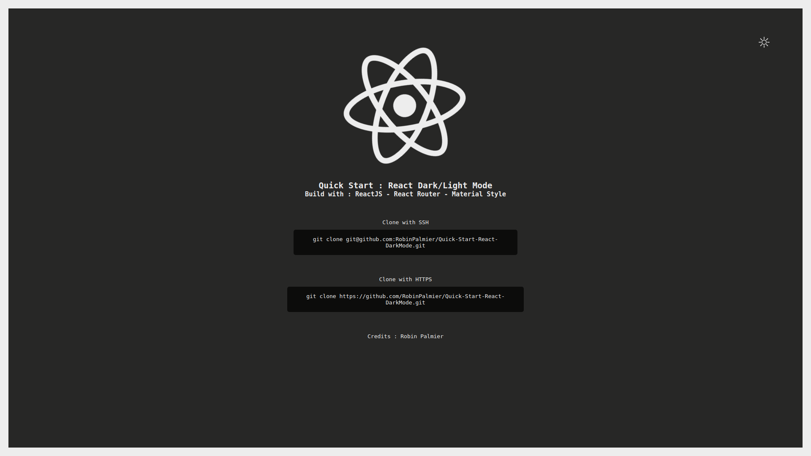
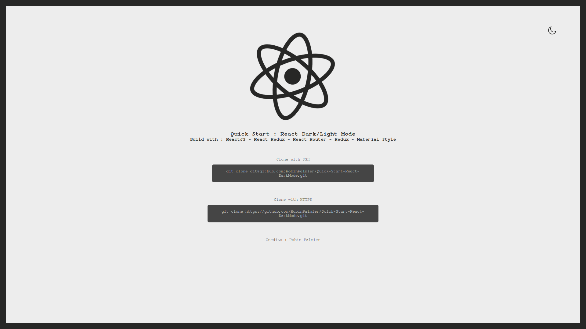

# Quick Start : React Dark/Light Mode
### *Start a react project with dark/light mode ready to use*

---
#### Render : &nbsp;
* Dark Mode

* Light Mode


---
#### Libraries used :

* [React JS](https://reactjs.org/)

* [React Router](https://github.com/ReactTraining/react-router)

* [Material Style](https://material-ui.com/styles/basics/)

---
#### Get Started : &nbsp;
##### Download the project
- Clone the project from github
- Use `cd` in the terminal to access in root of the project
##### Launch the project

- To install the dependencies, use the command : `npm install`
- To start the project, use the command : `npm start`

*OR* 
* If you are using docker-compose, you can start the project with : `docker-compose up`

*OR* 
* You can start the Dockerfile with : `docker run -it react-darkmode bash`

---
#### How to use :

* Open [colors.js](./src/assets/style/colors.js) file.

```js
const  palette  = {
	themeLight:  '#EDEDED', // Set the color for the light theme
	themeDark:  '#272726', 	// Set the color for the dark theme
};
```

---
#### Credit :
*30/06/2020* - MIT Licence - Robin Palmier
